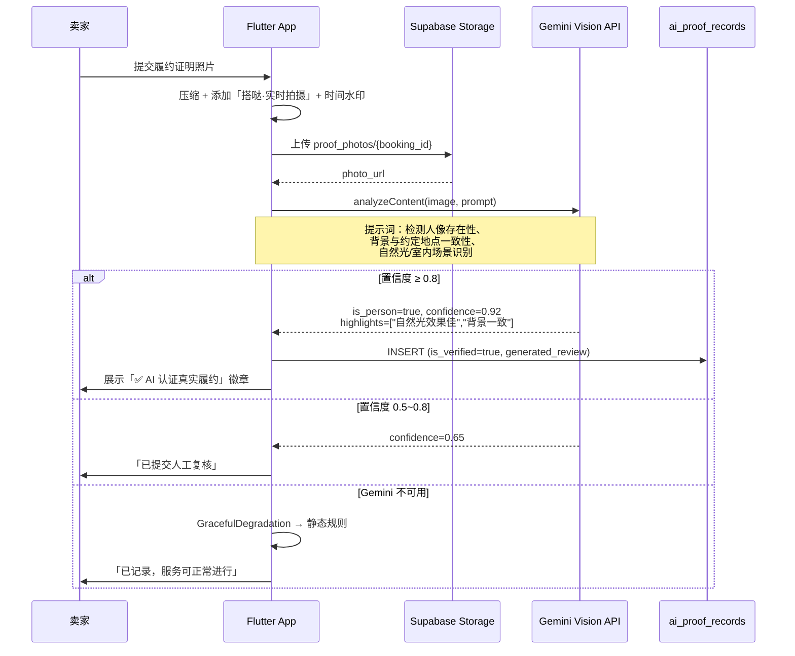
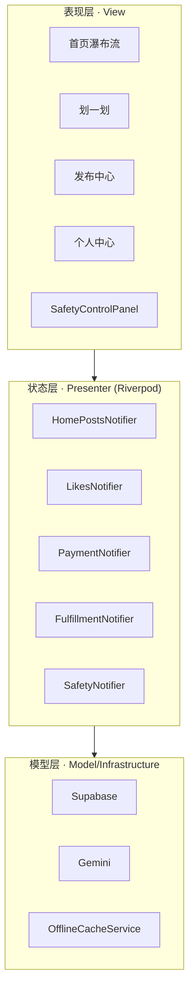

# 搭哒 (DaDa) — 非标社交服务的信任基础设施

> **解决二次元委托、摄影陪拍、社交陪玩等非标服务中最核心的信任痛点**  
> Flutter 全栈 · Supabase · Gemini AI 原生 · 打车级安全体系

[](https://flutter.dev)
[](https://supabase.com)
[](https://riverpod.dev)
[](https://ai.google.dev)

---

## 项目核心价值：解决非标社交服务信任痛点

非标服务（Cos 委托、摄影陪拍、游戏陪玩等）不同于标品电商，**履约质量高度依赖线下真人到场**。行业核心痛点包括：

| 痛点 | 传统方案局限 | 搭哒方案 |
|------|-------------|----------|
| **照骗** | 到现场发现与照片/描述严重不符 | Gemini Vision 真人核验 + 强制实时拍摄水印 |
| **预约跑路** | 口头约定，无资金保障 | 原子锁档期 + QR 核销 + 资金托管 |
| **线下安全** | 陌生人见面无保障 | 打车级安全守护：实时 LBS、地理围栏、一键 110 |
| **信任建立** | 纯主观评价，易造假 | AI 生成履约高光时刻 + 不可逆存证链 |

搭哒将 **AI 原生能力** 与 **交易闭环设计** 深度融合，为买卖双方搭建可验证、可追溯、可求助的信任基础设施。

---

## AI 原生特性：Gemini 真人履约核验

### 业务场景

订单进入「待评价」阶段时，**强制上传履约证明照片**。系统调用 Gemini Vision API 对照片进行多维度分析，实现自动化防「照骗」核验。

### 核验流程（端到端）



### 技术实现要点

1. **RetryPolicy 包裹**：Gemini 调用使用指数退避重试（`maxAttempts=3`, `timeout=15s`），应对网络抖动与限流。
2. **GracefulDegradation**：AI 服务不可用时，自动回退到基于标签的静态规则，**业务不中断**。
3. **不可逆存证**：`ai_proof_records` 表存储 `gemini_response` 完整 JSON、`confidence`、`highlights`，永久关联订单，支持审计与申诉。
4. **RLS 隐私**：仅订单买卖双方可读 AI 核验结果。

---

## 架构说明：MVP 模式 + Riverpod 状态管理

### 分层架构（Clean Architecture 精简版）

采用 **MVP（Model-View-Presenter）** 思路，结合 **Riverpod** 实现表现层与业务层解耦：



### Riverpod 状态管理设计

| Provider 类型 | 场景 | 示例 |
|---------------|------|------|
| `StateNotifierProvider` | 有状态业务 | `homePostsProvider`, `paymentProvider` |
| `StateNotifierProvider.family` | 按 ID 隔离实例 | `safetyProvider(bookingId)` — 每个订单独立安全守护 |
| `StreamProvider` | 实时数据 | `ordersStreamProvider`, `authStateProvider` |
| `FutureProvider.family` | 按参数请求 | `searchResultsProvider(keyword)` |
| `Provider` | 无状态单例 | `AnalyticsService`, `FeatureFlagService` |

### 路由架构（GoRouter）

- `StatefulShellRoute.indexedStack`：5 个 Tab 保持状态，切换无重载。
- 全屏路由：`/provider/:id`、`/payment/:id`、`/order/:id`、`/fulfillment/:id`、`/chat/:otherId` 等。
- **路由命名规范**：避免重复 `name` 导致冲突（见下方求职亮点）。

---

## 求职亮点：实战问题解决与核心模块实现

### 1. 修复 GoRouter 路由命名冲突 Bug

**问题**：`/chat`（消息列表）与 `/chat/:otherId`（聊天详情）均使用 `name: 'chat'`，导致 GoRouter 抛出  
`"duplication fullpaths for name \"chat\":/chat, /chat/:otherId"`。

**根因**：GoRouter 要求 `name` 与路径一一对应，同名前缀会冲突。

**解决**：将聊天详情路由的 `name` 改为 `chatDetail`，保留路径 `/chat/:otherId` 不变，命名语义清晰且符合框架约束。

```dart
// 修复前：两者 name 均为 'chat' → 冲突
GoRoute(path: '/chat', name: 'chat', ...);
GoRoute(path: '/chat/:otherId', name: 'chat', ...);  // ❌

// 修复后
GoRoute(path: '/chat/:otherId', name: 'chatDetail', ...);  // ✅
```

### 2. 实现安全守护中心（SafetyControlPanel）

从 0 到 1 实现 **打车级线下履约安全系统**，复刻滴滴行程守护逻辑：

| 能力 | 实现 |
|------|------|
| **守护模式** | 卖家扫码核销后，`paid → in_progress`，自动激活 `SafetyNotifier.startGuardian()` |
| **实时位置** | `update_my_location` RPC 每 4 秒上传，Realtime 订阅对方位置 |
| **地理围栏** | Haversine 距离计算：<300m 正常 / 300~500m 警告 / >500m 红色警报 |
| **一键求助** | `trigger_panic` RPC，写入 `safety_events`，推送给对方，60s 冷却防误触 |
| **行程分享** | 生成可分享 URL，支持发送至紧急联系人 |
| **隐私遮罩** | RLS 限制 `user_locations` 仅在 `in_progress` 订单期间对双方可见 |

**单元测试**：`test/unit/geofence_algorithm_test.dart` 覆盖 Haversine 精度、围栏阈值、跨子午线等 9 个用例。

---

## 核心功能速览

| 模块 | 技术要点 |
|------|----------|
| **首页** | SliverMasonryGrid 瀑布流、RepaintBoundary 优化、分页加载 |
| **划一划** | PhysicsCardSwiper、动态背景渐变、Diversity Score 注入 |
| **预约** | `create_booking_with_lock` 原子锁、ServiceTimelineCalendar |
| **支付** | QR 核销、核销码本地加密、Realtime 状态同步 |
| **履约** | ServiceTimeline、SafetyControlPanel、实时拍照水印 |
| **搜索** | 综合/达人/内容 Tab、关键词过滤、热搜/最近搜索 |
| **发布中心** | 数据看板、收到的评价、档期管理 |
| **匹配筛选** | 陪拍/陪玩/委托、性别/身高/风格/星座/MBTI 多维度 |

---

## 本地运行

```bash
flutter pub get

# Demo 模式（无需 Supabase）
flutter run -d chrome

# 正式环境（需配置）
flutter run -d chrome \
  --dart-define=SUPABASE_URL=https://xxx.supabase.co \
  --dart-define=SUPABASE_ANON_KEY=eyJxxx

# 单元测试
flutter test test/unit/

# 集成测试
flutter test integration_test/
```

---

## 技术栈

| 层级 | 选型 | 理由 |
|------|------|------|
| 框架 | Flutter 3.x | 跨平台、高性能、丰富生态 |
| 状态 | Riverpod | 与 Supabase Realtime 天然契合，family 支持多实例 |
| 后端 | Supabase | PostgreSQL + RLS + Realtime，原子锁、复杂 SQL |
| AI | Gemini Vision | 多模态理解，真人核验、高光时刻生成 |
| 路由 | GoRouter | 声明式、深链、Shell 保持 Tab 状态 |
| 缓存 | FlutterSecureStorage | 核销码加密存储，离线可用 |

---

*搭哒 v2.0 · 非标服务信任基础设施 · Built with Flutter & Gemini AI*
