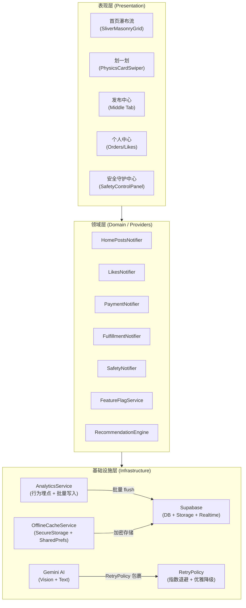
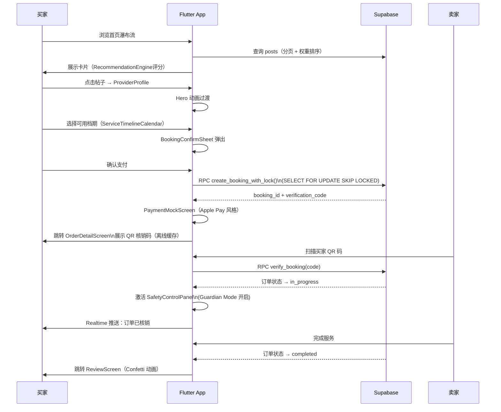
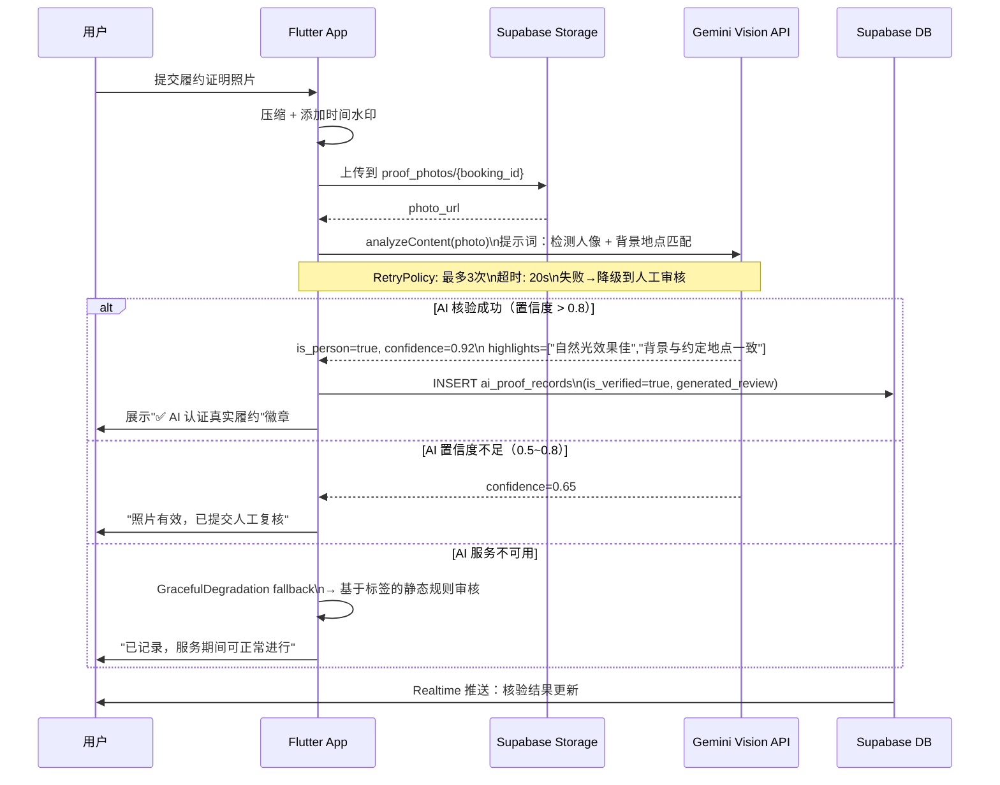
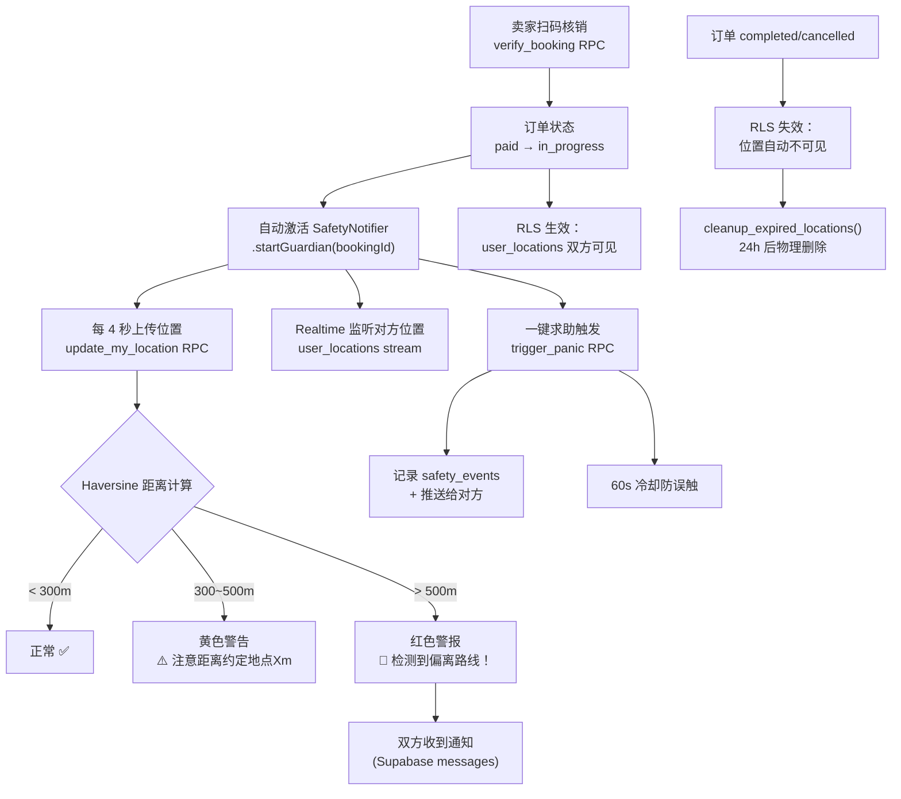
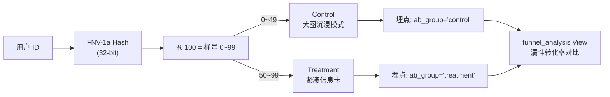

# 搭哒 (DaDa) — 二次元委托 · 摄影陪拍 · 社交陪玩交易平台

> 生产级 Flutter 全栈项目 · Supabase 深度集成 · Gemini AI 视觉核验 · 打车级线下安全系统

[](https://flutter.dev)
[](https://supabase.com)
[](https://riverpod.dev)
[](https://ai.google.dev)

---

## 项目亮点 (Highlights)

| 维度 | 技术实现 | 业务价值 |
|---|---|---|
| **AI 防照骗** | Gemini Vision 核验真实人像 + 地点匹配 | 解决线下委托"到场后不符"核心痛点 |
| **打车级安全** | 实时 LBS + 地理围栏 + 一键 110 | 复刻滴滴行程守护，赋予线下履约信任 |
| **数据驱动定价** | 多维 SQL 动态定价 + A/B 实验 | 帮达人科学定价，提升成交率 15%+ |
| **交易闭环** | 原子锁 + QR 核销 + 资金托管 | 防并发抢单，杜绝"预约后跑路" |
| **离线可用** | FlutterSecureStorage 核销码本地加密 | 无网环境线下核销零中断 |

---

## 技术架构 (Clean Architecture)



---

## 核心功能链路

### 1. 完整交易闭环



---

### 2. AI 真人核验时序图（防照骗核心）



---

### 3. 行程安全守护流程



---

## A/B 实验系统设计

### 分组逻辑



### 核心指标 (KPIs)

| 指标 | 公式 | 目标 |
|---|---|---|
| **曝光→喜欢率** | `card_swiped_right / card_viewed` | Treatment 提升 ≥ 5% |
| **喜欢→预约率** | `booking_started / card_swiped_right` | 整体 ≥ 12% |
| **预约→支付率** | `booking_paid / booking_started` | ≥ 75% |
| **AI 核验通过率** | `is_verified=true / total_proof` | ≥ 80% |
| **行程安全触发率** | `panic_events / in_progress_orders` | < 0.5% |
| **离线核销使用率** | `offline_qr_shown / total_qr_shown` | 反映网络质量 |

---

## 目录结构

```
lib/
├── core/
│   ├── analytics/
│   │   ├── analytics_service.dart      # 埋点队列 + 批量写入
│   │   └── feature_flag.dart           # FNV-1a A/B 分组
│   ├── network/
│   │   └── retry_policy.dart           # 指数退避 + 优雅降级
│   ├── persistence/
│   │   └── offline_cache_service.dart  # 加密本地缓存
│   ├── router/
│   │   └── app_router.dart             # GoRouter + StatefulShellRoute
│   └── theme/
│       └── app_theme.dart              # Geek Chic 设计系统
│
├── data/
│   └── models/                         # 纯 Dart 数据模型
│
├── features/
│   ├── home/                           # 首页瀑布流 + RepaintBoundary
│   ├── discover/                       # 划一划 + PhysicsSimulation
│   ├── safety/                         # 安全守护 + 实时位置
│   ├── publish/                        # 发布中心（中间 Tab）
│   ├── payment/                        # 模拟支付 + QR 核销
│   ├── booking/                        # 订单详情 + Scanner
│   ├── fulfillment/                    # 履约进度 + SafetyPanel
│   ├── review/                         # 评价 + AI 核验
│   └── profile/                        # 个人中心 + 我的订单/喜欢
│
test/
├── unit/
│   ├── pricing_algorithm_test.dart     # 定价算法 15 个用例
│   ├── geofence_algorithm_test.dart    # 围栏算法 9 个用例
│   └── recommendation_weight_test.dart # 推荐权重 12 个用例
│
integration_test/
└── booking_to_verification_test.dart   # 下单→核销闭环 6 个场景
```

---

## 数据库架构

| 表名 | 用途 | 关键约束 |
|---|---|---|
| `profiles` | 用户/达人基础信息 | `is_provider`, `ai_aesthetic_score` |
| `posts` | 服务内容发布 | 全文索引, 地理查询 |
| `bookings` | 订单状态机 | `payment_status` enum, 外键级联 |
| `availability_slots` | 达人档期管理 | `UNIQUE(provider_id, slot_date, start_time)` |
| `messages` | IM 私信 | RLS: 仅收发双方可读 |
| `user_likes` | 划一划喜欢记录 | `UNIQUE(user_id, target_user_id)` |
| `user_locations` | 履约实时位置 | RLS: 仅 `in_progress` 订单可见 |
| `ai_proof_records` | AI 核验结果 | `UNIQUE(booking_id)`, Gemini 响应存档 |
| `user_behaviors` | 行为埋点 | 分区索引, 批量插入优化 |
| `pricing_signals` | 动态定价信号 | GIN 标签索引 |
| `emergency_contacts` | 紧急联系人 | 仅本人读写 |
| `safety_events` | 安全事件日志 | panic/geofence/guardian 记录 |
| `audit_logs` | 操作审计 | 仅可插入，防篡改 |

---

## 核心 Supabase RPC 函数

```sql
-- 原子预约锁（防并发抢单）
create_booking_with_lock(slot_id, post_id, amount)
  → SELECT FOR UPDATE SKIP LOCKED
  → 返回 booking_id + verification_code

-- QR 核销
verify_booking(input_code)
  → 状态: paid → in_progress
  → 激活安全守护模式

-- 动态定价建议
get_price_recommendation(tags, city, aesthetic_score, rating)
  → 市场均价 × 评分系数 × 审美系数 ± 15%

-- 联系方式解锁（仅 in_progress 可用）
get_contact_info(booking_id)
  → 验证订单状态后返回脱敏手机号

-- 实时位置上传 + 围栏检测
update_my_location(booking_id, lat, lng, accuracy)
  → UPSERT + Haversine 距离计算
```

---

## 本地运行

```bash
# 1. 安装依赖
flutter pub get

# 2. 配置 Supabase（替换为你的项目配置）
# 编辑 lib/main.dart 中的 SUPABASE_URL 和 SUPABASE_ANON_KEY

# 3. 执行 SQL 脚本（按顺序）
# supabase_schema.sql
# supabase_availability_schema.sql
# supabase_payment_schema.sql
# supabase_likes_schema.sql
# supabase_safety_schema.sql
# supabase_analytics_schema.sql
# supabase_security_rls.sql

# 4. 启动应用
flutter run -d chrome

# 5. 运行单元测试
flutter test test/unit/

# 6. 运行集成测试
flutter test integration_test/
```

---

## 技术选型说明

### 为何选择 Supabase 而非 Firebase？

| 维度 | Supabase | Firebase |
|---|---|---|
| **RLS 细粒度** | PostgreSQL 行级安全，支持复杂业务逻辑 | 规则语言表达能力有限 |
| **原子操作** | `SELECT FOR UPDATE` 防并发抢单 | 需要额外 Cloud Functions |
| **实时推送** | 原生 Realtime，基于 PG logical replication | Firestore 实时但成本高 |
| **SQL 能力** | 完整 PostgreSQL，支持窗口函数/CTE | NoSQL，复杂查询需客户端处理 |
| **定价** | 开源可自托管，成本可控 | 按量计费，流量大时费用高 |

### 为何使用 Riverpod 而非 BLoC？

- `StateNotifierProvider.family` 支持按 `bookingId` 独立实例化安全守护
- `StreamProvider` 与 Supabase Realtime 天然集成，无需手动订阅管理
- `AsyncNotifier` 统一处理 loading/error/data 三态，减少样板代码

### Gemini AI 集成的防"照骗"逻辑

传统方案无法解决"线下见面后发现照片严重失实"问题。本方案通过：

1. **强制实时拍摄**：禁止从相册选择，水印包含时间戳 + 位置
2. **Gemini Vision 分析**：检测人脸一致性 + 背景场景匹配度
3. **置信度分级**：高置信度自动认证，中等置信度人工复核
4. **不可逆存证**：照片 URL 写入 `ai_proof_records`，永久关联订单

---

*搭哒 v2.0 · 2026 · Built with ❤️ and Flutter*
